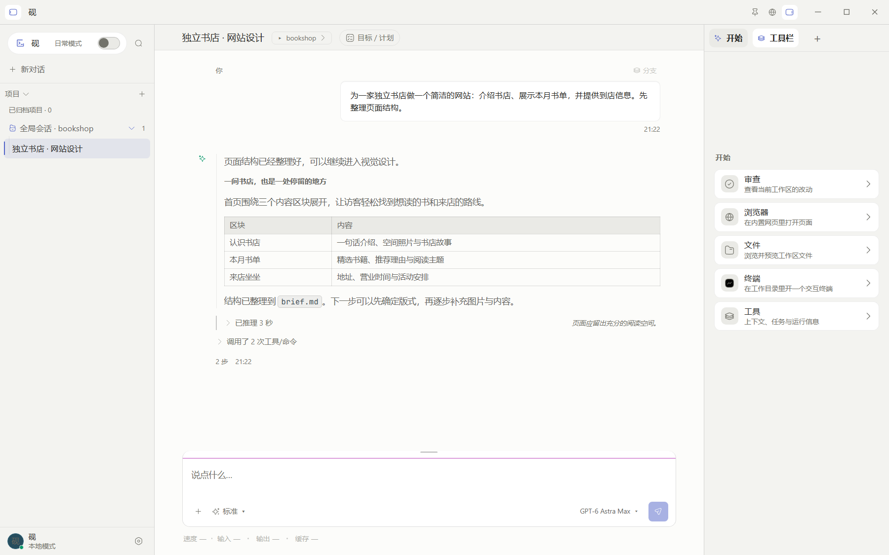

<p align="center">
  
</p>

<h1 align="center">让想法成形。</h1>
<p align="center">Give ideas form.</p>
<p align="center">砚 · 一个专注于内容与行动的桌面 AI 工作空间。</p>

<p align="center">
  <a href="https://github.com/Yu-DaTouX/Inkstone/releases">下载</a> ·
  <a href="#开始使用">快速开始</a> ·
  <a href="docs/GETTING_STARTED.md">使用指南</a> ·
  <a href="https://github.com/Yu-DaTouX/Inkstone/issues">反馈</a> ·
  <a href="README_EN.md">English</a>
</p>
<p align="center"><sub>Windows · 多模型接入 · 深浅主题 · MIT 开源</sub></p>

<br>

<picture>
  <source media="(prefers-color-scheme: dark)" srcset="docs/assets/inkstone/workspace-dark.png">
  <source media="(prefers-color-scheme: light)" srcset="docs/assets/inkstone/workspace-light.png">
  
</picture>

<p align="center"><sub>开发分支界面预览 · 演示配置：GPT-6 Astra Max · 会话与工具结果为演示数据</sub></p>

## 从一个想法，到一份作品

**Inkstone（砚）** 将对话、项目、文件和工具放在同一个桌面工作空间里。你可以从一个问题开始，带上已有资料，与 AI 一起梳理思路、修改代码、运行命令，并查看工作的过程与产出。

砚是承接笔墨的地方。Inkstone 延续这个意象：让内容成为中心，让输入始终触手可及，让执行细节在需要时展开。

## 在同一处，把工作接着做

| 你想做什么 | Inkstone 提供什么 |
| --- | --- |
| **把思路说清楚** | 流式对话、图片输入、`@` 文件引用、`/` 命令；推理和工具过程可展开查看。 |
| **围绕项目推进** | 项目分组、会话搜索、分支与队列；切换会话时，已经运行的任务可以继续在后台执行。 |
| **查看过程与产出** | 文件预览、改动审查、交互终端、内置浏览器和本机 Chrome 接入。 |
| **让任务有进展可循** | 目标与计划、任务清单、子代理状态，以及上下文和运行信息。 |
| **选择合适的模型** | 接入模型服务、切换模型与思考档位，在同一套界面中工作。 |
| **按自己的习惯使用** | 深浅主题、中英界面、可调栏宽与缩放，以及可整理的工具区。 |

模型能力、额度和费用取决于所接入的服务。

## 安静、清楚、精致

Inkstone 的界面围绕“墨色工作空间”设计：

- **内容优先。** 把阅读、产出和下一步输入放在主要位置；执行过程先显示摘要，细节按需展开。
- **文字各司其职。** 界面与正文采用无衬线字体；代码、命令和路径采用等宽字体。
- **克制地表达层级。** 用留白、暖中性色和少量边界组织界面，以单一强调色引导操作。

品牌图标中的开口石框代表工作空间，`>_` 代表输入与行动。

## 开始使用

### 下载 Windows 版本

前往 [Releases](https://github.com/Yu-DaTouX/Inkstone/releases)，按发布说明选择安装版、单文件便携版或 ZIP 版。ZIP 版解压后运行 `砚.exe`；发行包包含 pi 运行时，无需单独安装 pi。

**发行包与开发分支可能不同步。** 本页功能介绍和截图面向开发分支，具体发行版内容以对应发布说明为准。

### 接入模型，开始第一项工作

1. 在 **设置 → 模型接入** 中配置服务。选择服务后，可直接在软件内完成登录或配置 API 凭证，无需使用终端登录。
2. 选择项目或新建对话，在输入框写下任务；用 `@` 引用文件，用 `/` 查看可用命令。
3. 在工作面板中查看文件、审查改动，或打开浏览器与终端继续操作。

常用操作、数据备份与安装说明见[使用指南](docs/GETTING_STARTED.md)。

## 数据与平台

目前提供 Windows 版本，尚未提供 macOS、Linux 发行包或代码签名。会话与设置保存在本机；跨设备同步暂不提供。

连接远程模型时，请求会发送到所选服务。单文件便携版与安装版的数据位置有所不同，迁移前请按[使用指南](docs/GETTING_STARTED.md#数据与备份)备份。

## 开源与反馈

欢迎通过 [Issues](https://github.com/Yu-DaTouX/Inkstone/issues) 反馈问题或提出建议。请附上应用版本、复现步骤与必要截图，并隐去密钥和私人内容。

<details>
<summary>开发者：从源码运行与参与贡献</summary>

Inkstone 使用 Electron、React 和 TypeScript，并由 [pi](https://github.com/badlogic/pi-mono) 提供模型循环与工具执行。

准备 Git、Node.js（建议 24）和 npm，在 PowerShell 中执行：

```powershell
git clone https://github.com/Yu-DaTouX/Inkstone.git
cd Inkstone
npm install -g @earendil-works/pi-coding-agent
npm run launch
```

启动器会检查依赖、准备缺失的内置运行时并按需构建。已有工作区可双击 `启动-砚.cmd`；开发模式使用 `开发-砚.cmd` 或 `npm run launch:dev`。

参与贡献前请阅读 [工作区约定](AGENTS.md)。工程说明与检查方式见[开发文档索引](docs/README.md)。

</details>

## 许可证

[MIT](LICENSE) · © 2026 Yu-DaTouX。第三方字体、图标、代码高亮和内置 pi 的许可随分发保留。
