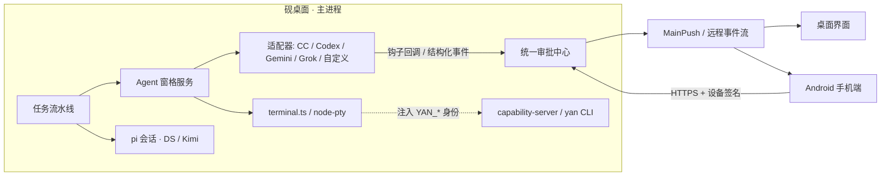

# 多 Agent 工作台设计

[文档索引](README.md) · [架构简介](ARCHITECTURE.md) · [代码地图](CODE_MAP.md) · [手机接入](MOBILE_ACCESS.md) · [砚互联](PEER_ACCESS.md) · [技术路线](TECH_STACK_OPTIONS.md)

**状态：设计稿（2026-09-29），尚未实现。** 本页记录已与用户确认的产品决定和建议的技术方案；接口以实现时的源码为准，外部 CLI 的钩子与协议需按当时版本重新核实。

## 1. 背景与目标

常见的开发流程是：Codex（GPT）与 Claude Code 出方案 → Claude Code 实施 → 砚内 pi（DeepSeek / Kimi）审查与测试。现在这三个 agent 分在三个桌面应用里，靠人工复制方案、差异和报告来回传递。

目标是让砚成为这些 agent 的**统一工作台**：

1. **在砚里运行外部终端 agent**：Claude Code、Codex 等以真实 PTY 窗格运行，统一看到每个 agent 是运行中、等待审批、已完成还是空闲（参考 [Herdr](https://github.com/herdrdev/herdr) 的“agent 感知终端复用器”思路）。
2. **agent 之间互相派活**：以可复用的任务流水线串起设计、实施、审查与测试，阶段产出以文件交接。
3. **手机与桌面同权**：在手机上查看、输入、审批和启动 agent（参考 [Moshi](https://getmoshi.app/) 的手机端交互）。

主要目标是第 2 条；第 1、3 条是它的运行基础。

## 2. 已确认的决定

| 主题 | 决定 |
| --- | --- |
| 优先方向 | 以 agent 之间互相派活为主，并排管理为基础能力 |
| 首批适配 | Claude Code、Codex、Gemini CLI、Grok Build CLI；砚内 pi（常用 DeepSeek、Kimi）作为原生 agent，不需要适配 |
| 手机权限 | 手机获得完整权限：可向 agent 窗格输入、批准或拒绝 CC / Codex 等外部 agent 的审批；**pi 的敏感确认也统一放开**，手机可直接同意 |
| 免审批模式 | 是否允许从手机以免审批模式（如 CC 的 `--dangerously-skip-permissions`、Codex 全自动模式）启动 agent，由手机端设置决定，默认关闭 |
| 砚退出 | 退出前检查所有 agent：全部停止则直接关闭；仍在运行则提醒用户 |
| 砚互联 | 被控端增加配置，按对端设定开放权限的等级 |
| 远程连接 | 继续寻找比 Tailscale 更安全、更方便的方式；调研结论见第 10 节 |

## 3. 范围与非目标

**首版范围**：Windows 桌面上的 agent 窗格、状态检测、统一审批、退出检查、任务流水线；Android 手机端的 agent 列表、审批、输入与通知；远程连接的应用层加固；砚互联权限等级。

**非目标**：
- 不内嵌 Herdr 或其他复用器的二进制，基于现有 `src/main/terminal.ts`（`node-pty`）实现。
- 不接管外部 agent 的模型凭证。CC、Codex、Gemini、Grok 使用各自官方 CLI 的登录与额度，砚不读取、不转用它们的令牌。
- 不随包分发外部 CLI，只检测和引导安装。
- 不连接外部主机上的 agent（SSH 到 Linux 主机等），与[技术路线](TECH_STACK_OPTIONS.md)一致。
- 不一次适配 Herdr 支持的全部 agent；其余 agent 通过“自定义命令”窗格运行，状态精度较低。

## 4. 总体结构



新增代码建议集中在独立领域模块（例如 `src/main/agent-panes/`、`src/shared/agent-pane.ts`，经 `src/main/ipc/` 的独立注册器接入），避免在 `src/main/index.ts`、`src/shared/ipc.ts` 等共享热点文件里堆业务。

## 5. Agent 窗格

### 5.1 运行方式

- 一个 agent 窗格就是一个 `terminal.ts` 会话，加上 `kind`（适配器）、`paneId`、外部会话 ID、状态和所属任务。全屏 TUI 通过 xterm 原样显示。
- 默认每个会改代码的 agent 在独立 worktree 中运行，复用 `subagent-isolation.ts` 的隔离能力；合回通过砚的审查面板完成。
- 窗格随砚的主进程运行，不另建常驻后台进程（常驻进程会增加生命周期、自启与升级维护量）。砚重启后，用外部 agent 的恢复命令接回会话（见 5.3）。

### 5.2 适配器

每个适配器描述：启动命令、恢复命令、状态来源、审批通道、结构化输出方式、安装检测。

| agent | 审批通道 | 结构化驱动 | 备注 |
| --- | --- | --- | --- |
| Claude Code | hooks；部分钩子可直接返回允许 / 拒绝 | `claude -p --output-format stream-json`、Claude Agent SDK | 首批 |
| Codex | app-server 协议中的结构化审批请求；`notify` 钩子 | `codex exec --json`、app-server | 首批；Windows 原生支持程度需实测 |
| Gemini CLI | `BeforeTool` hook 同步返回允许 / 拒绝 | 有 | 首批 |
| Grok Build CLI | `PreToolUse` hook，退出码 0 允许、2 拒绝 | `--format json`（NDJSON 事件流） | 首批；有社区报告插件加载的 hooks 未被触发，需实测 |
| 自定义命令 | 无，退回 PTY 输入 | 无 | 通用兜底 |

**钩子不写入用户的全局配置**（`~/.claude`、`~/.codex`、`~/.gemini` 等）。砚每次启动窗格时临时注入钩子配置（例如 CC 的 `--settings`、Codex 的 `-c` 覆盖，具体方式按各 CLI 当时版本确定）。钩子脚本在检测不到砚的窗格身份时不做任何事，避免影响在砚外启动的同一 CLI。

### 5.3 状态与恢复

- 状态统一为：`working`（运行中）、`blocked`（等待审批或输入）、`done`（本轮完成）、`idle`（空闲）、`exited`（进程已退出）。
- 优先用钩子与结构化事件判断状态；无钩子时用输出静默时长和提示符特征兜底。Herdr 对 CC、Codex 仅用钩子上报会话身份，状态靠屏幕识别，砚应做得更准。
- 适配器记录外部会话 ID 与恢复命令（如 `claude --resume <id>`），用于砚重启、窗格误关后接回。
- 借鉴 Herdr 屏幕识别规则前需先确认其许可证；只借鉴思路，不复制代码。

### 5.4 与 pi 的关系

pi 是砚的原生执行核心，事件完整，不作为窗格运行。流水线中 pi 与外部 agent 是同等的“执行者”，共享任务、运行实例与交接语义，不另建一套状态机。

## 6. 退出检查

砚退出时（现有实现会在退出时 `disposeTerminals()` 结束所有终端）：

1. 汇总所有 agent 窗格与 pi 运行的状态。`idle`、`done`、`exited` 视为已停止。
2. 全部已停止：直接退出；退出前保存每个窗格的外部会话 ID，以便下次恢复。
3. 有 `working` 或 `blocked`：弹出提醒，列出这些 agent 及其任务，提供三个选项：
   - **等全部完成后自动退出**（期间出现新的审批仍会提醒）；
   - **强制结束**并退出；
   - **取消**。
4. Windows 关机或注销时砚无法阻止退出，只尽量保存状态。电脑休眠时 agent 同样暂停。

## 7. 统一审批

- 所有审批（外部 agent 的工具授权、pi 的问题与敏感确认）进入同一个审批中心，桌面与手机看到同一份列表。
- **优先走结构化通道**（钩子返回值、app-server 回复）；只有 TUI 时才退回为向 PTY 写入对应按键，写入前核对提示仍然有效，避免误按到下一个提示。
- **并发**：桌面和手机同时操作时，先到者生效，另一端立即刷新为“已处理”。
- **超时**：钩子审批等待超时后退回到 TUI 中继续等待，不自动批准。
- 显示外部 agent 自带的“本会话总是允许”等选项。
- **pi 的敏感确认**：去掉“手机只能拒绝”的限制。涉及 `src/main/remote-host.ts` 的 `sensitive_confirmation_requires_desktop` 分支、`AgentController` 中对应的拒绝逻辑、`mobile/src/components/QuestionCard.tsx` 与首页 / 通知文案，以及 [手机接入说明](MOBILE_ACCESS.md) 与 [砚互联说明](PEER_ACCESS.md) 中的对应描述。
- 每次审批与手机输入都写入审计记录（设备、窗格、时间、内容摘要），桌面可查看。

## 8. 任务流水线（互相派活）

### 8.1 模板

```
任务 ─▶ 设计（Codex + Claude Code）─▶ 方案文档 ─▶ 【关卡：用户确认】
     ─▶ 实施（Claude Code，独立 worktree）─▶ 代码差异
     ─▶ 审查与测试（pi · DeepSeek / Kimi）─▶ 审查报告
            ├─ 通过 ─▶ 【关卡：用户确认合并】
            └─ 不通过 ─▶ 带报告回到实施（有轮次上限）
```

- 流水线可保存为模板；每个阶段选用哪个 agent、使用哪个模型可替换。
- **阶段之间以文件交接**：方案文档、差异、审查报告、测试结果。下一阶段的 agent 读文件，不读上一个 agent 的完整对话，节省上下文，也便于用户查看和修改。
- **关卡**可在桌面或手机上确认、修改后放行或退回。
- 复用砚现有的子代理、交接与 worktree 隔离能力，把外部 agent 作为新的执行后端接入。

### 8.2 驱动方式

- 外部 agent 优先用非交互 / 结构化模式执行阶段任务（`claude -p`、`codex exec`、Gemini 与 Grok 的 JSON 输出），结果与审批都是结构化的。
- 需要人工介入时，同一阶段可切换到交互窗格继续。

### 8.3 安全与成本

- **防循环**：agent 之间的消息与派活设跳数上限，每条回路设轮次上限。
- **防注入**：其他 agent 发来的内容一律作为数据，不作为指令；外部 agent 写砚的长期记忆只能提交候选，由用户确认（沿用[记忆互通](MEMORY_INTEROP.md)规则）。
- **额度**：并行运行会快速消耗订阅额度，在现有额度区显示各 agent 的用量（可行性按各 CLI 提供的信息确定）。

## 9. 外部 agent 调用砚

- **身份注入**：窗格启动时注入该窗格专属的 `YAN_*` 身份，外部 agent 在自己的 shell 工具里即可调用 `yan` CLI（见 `resources/yan-cli/yan.mjs` 与 `capability-server.ts`）。每个窗格单独发放令牌并按能力白名单授权，不复用 pi 会话的令牌。
- **砚 MCP 服务**（第二步）：提供一个薄的 stdio MCP 服务，转发到 capability-server，向外部 agent 暴露如下工具：
  - `yan_send`：给其他 agent 或会话发消息、派活；
  - `yan_read_session`：读取其他会话的摘要与成果；
  - `yan_memory`：读取项目知识、提交记忆候选；
  - `yan_ask_user`：经砚的提问通道询问用户（手机可收到）。

## 10. 远程连接与安全

### 10.1 现状问题

远程服务目前是明文 HTTP 加 Bearer 令牌（`src/main/remote-server.ts` 使用 `node:http`）。走 Tailscale 时由 WireGuard 加密；选“局域网”模式时令牌可在同一网络中被嗅探。手机获得完整权限后，这相当于远程控制电脑的入口，必须先加固。

### 10.2 方案调研

| 方案 | 方便程度 | 安全性 | 国内情况 |
| --- | --- | --- | --- |
| Tailscale（现状） | 装 App 登录即可 | 高：WireGuard 加密、账号两步验证与 ACL | 官方中继无大陆节点，打洞失败时延迟高 |
| Tailscale + 自建 DERP | 需国内服务器与 HTTPS 证书 | 同 Tailscale | 社区实测延迟可降至 20–30ms |
| Headscale | 需自建控制服务器 | 高，完全自主 | 同上 |
| NetBird | 与 Tailscale 相当，可自建 | 高 | 资料较少 |
| EasyTier | 无需账号，有 Android 客户端 | 认证依赖共享的网络名与密码，弱于 Tailscale | 复杂 NAT 下打洞能力强 |
| ZeroTier | 方便 | 中等 | 国内体验一般 |
| 砚内置 P2P 打洞（如 iroh） | 用户最省事 | 可做到高 | 需引入原生库并维护中继，个人维护成本过高，不采用 |

### 10.3 建议：安全放在应用层，网络层可自选

1. **HTTPS 与证书固定**：砚自行生成证书，证书指纹写入配对二维码，手机只信任该证书。局域网下也无法嗅探或冒充。
2. **设备密钥签名**：手机在 Android 安全存储中生成密钥对，配对时登记公钥，此后每个请求签名，替代单纯的 Bearer 令牌；令牌泄露后没有设备私钥也无法使用。
3. 完成上两步后，Tailscale、EasyTier、局域网、端口转发都可安全使用，砚不内置 VPN。推荐：默认 Tailscale；国内延迟高时自建 DERP；Tailscale 打不通的网络可改用 EasyTier。
4. 保留：撤销设备立即断开事件流与写入通道；锁屏通知不显示命令内容；批准前可选的生物识别确认（设置项，默认关闭）。
5. 在第 1、2 步完成前，完整权限只在 Tailscale 模式下生效。

## 11. 手机端

- **Agent 分组**：工作台列出电脑上的 agent 窗格与 pi 运行，显示状态与所属任务。
- **卡片模式（默认）**：状态、最近输出摘要、待审批项（允许 / 拒绝 / 打开终端）。
- **终端模式**：原样显示 PTY，需要新增 `react-native-webview` 与 xterm.js 依赖；利用 `terminal.ts` 带 `seq` 的环形缓冲做断线续传。现有通道为 SSE 加 POST，需实测高频输出下的流量与延迟。
- **快捷键栏**：Esc、Tab、Ctrl-C、方向键、Enter 及各 agent 常用确认键。
- **输入**：可直接向窗格写入；复用现有语音输入，识别结果先填入输入框，确认后写入。
- **启动 agent**：可在手机上新建窗格；免审批模式受手机端设置控制（默认关闭）。
- **通知**：扩展现有“待回答提醒”，把 agent 的“等待审批”和“完成”纳入常驻通知，点通知直达审批页。

## 12. 砚互联权限等级

被连接方为每个已配对的对端设置**最高开放等级**：

| 等级 | 允许的操作 |
| --- | --- |
| 只读（默认） | 查看开放项目的会话、成果与 agent 状态 |
| 可发消息 | 以上，加向会话发消息、新开任务 |
| 可审批 | 以上，加处理审批 |
| 完全控制 | 以上，加向 agent 窗格输入、启动与结束 agent |

- 等级是上限；现有“本次连接”的申请与批准流程保留，每次批准只能在上限内授权。
- 砚互联不继承手机的完整权限；模型凭证、SSH 私钥、个人记忆仍不开放。

## 13. 数据与历史

- 外部 agent 的对话记录（如 `~/.claude/projects`、`~/.codex/sessions`）以其自身文件为事实源。砚只读投影到会话历史与搜索，不复制、不改写。
- 终端回滚缓冲只用于显示，不作为历史记录。
- 流水线的阶段产出、审批与审计记录存放在砚的数据目录，按任务归档。

## 14. 分阶段实施

| 阶段 | 内容 | 验证 |
| --- | --- | --- |
| 1 | Agent 窗格与 CC、Codex 适配器；状态检测；退出检查 | 本机模拟 CLI（假 TUI 输出与钩子）；真实联调前确认模型与额度 |
| 2 | 远程连接加固（HTTPS 证书固定、设备签名）；统一审批中心；pi 敏感确认放开 | 协议单元测试；手机真机配对 |
| 3 | 手机端 Agent 卡片、审批、通知 | Android 真机截图 |
| 4 | 任务流水线与模板；`yan` 身份注入 | 用一条真实流程验证：设计 → 实施 → 审查 → 合并 |
| 5 | Gemini CLI、Grok 适配器；手机终端模式与快捷键栏；砚 MCP 服务；砚互联权限等级 | 按适配器分别实测 |

界面相关决定（窗格在侧栏中的位置、卡片样式等）先写入[设计规范](DESIGN_SYSTEM.md)再改代码。

## 15. 待确认事项与风险

**待确认**：
- 两个 agent 共同设计时如何合并方案：各写一份后由用户或 pi 比较合并；一个起草、另一个评审修改；或只指定一个设计者。流水线模板可以支持三种，需确定默认方式。

**风险**：
- 外部 CLI 的钩子格式、JSON 事件与恢复命令随版本变化，适配器需做版本检测。
- CC、Codex 在 Windows 原生环境（ConPTY、Git Bash 依赖、Codex 的原生支持程度）的表现需实测。
- 手机完整权限扩大了攻击面，第 10 节的加固须先于或同时于权限放开交付。
- 多个 agent 并行会显著增加额度消耗与同一仓库的合并冲突。

## 参考

- Herdr：[Integrations 文档](https://github.com/herdrdev/herdr/blob/master/docs/versions/0.8.0/website/src/content/docs/integrations.mdx) · [Agent automation](https://herdr.dev/docs/agent-automation/)
- Moshi：[官网](https://getmoshi.app/) · [Herdr 指南](https://getmoshi.app/guides/herdr)
- Gemini CLI：[Hooks](https://geminicli.com/docs/hooks/) · [Hooks reference](https://geminicli.com/docs/hooks/reference/)
- Grok Build：[概览](https://docs.x.ai/build/overview) · [Hooks](https://docs.x.ai/build/features/hooks)
- 远程连接：[Tailscale 替代方案对比](https://pinggy.io/blog/top_open_source_tailscale_alternatives/) · [NetBird vs Tailscale vs Headscale](https://www.infralovers.com/blog/2026-05-27-netbird-vs-tailscale-vs-headscale/) · [自建 DERP 中继](https://cloud.tencent.com/developer/article/2689161)
