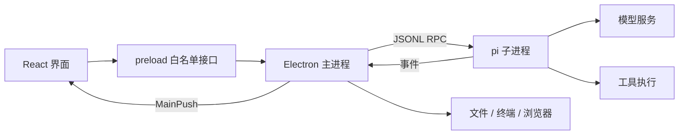

# Inkstone 架构简介

Inkstone 使用 Electron、React 和 TypeScript，通过独立 pi 子进程完成模型循环与工具执行。

## 职责

- **渲染进程**：会话与项目界面、输入、内容展示和用户操作；通过 preload 使用宿主能力。
- **preload 与共享契约**：限制可调用入口，维护跨进程类型和事件结构。
- **主进程**：会话生命周期、pi RPC、文件和终端、浏览器表面及配置持久化。
- **pi**：模型循环、上下文与工具执行；随包适配位于 `resources/`。

## 数据与运行边界

本地设置和会话由应用与 pi 持久化；连接远程模型时，请求发送至所选服务。数据位置见 [发布与备份](dev/RELEASING.md#数据位置与备份)。应用的本地档案不等于模型账号登录。

Electron 网页表面与 React DOM 分属不同层，浏览器浮层、窗口缩放和焦点切换需要在宿主与界面间协调。切换会话时应明确各事件所属的会话，避免后台事件覆盖当前会话状态。

具体文件入口见 [代码导览](PROJECT.md)。接口以源码为准，本页不记录内部排期或阶段验收结论。
