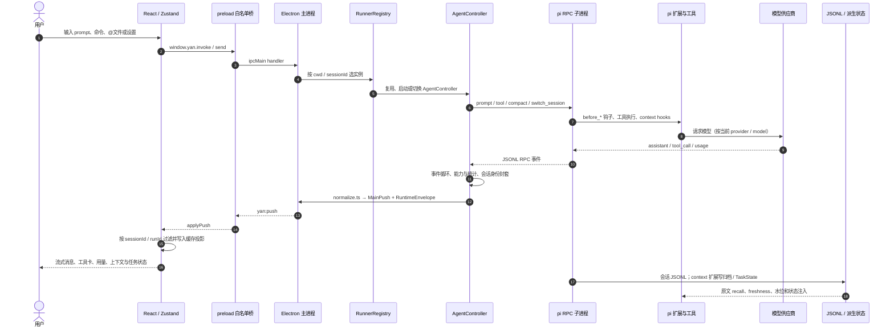

# 砚（Yan）整体软件架构图

> 这份图按 **2026-09-17** 当前 checkout 的源码与当前文档整理。它描述现有实现的边界和数据流，不把历史方案或未接入的设计稿当成运行组件。
>
> Mermaid 源文件：[`ARCHITECTURE.mmd`](ARCHITECTURE.mmd) · 可直接打开的网页：[`ARCHITECTURE.html`](ARCHITECTURE.html)

## 怎么看

先从左到右看一次主链条：用户操作进入 React 渲染进程，经 preload 白名单桥到 Electron 主进程，再由 `RunnerRegistry` 选择会话运行实例，`AgentController` 通过手写 JSONL RPC 驱动独立的 `pi --mode rpc` 子进程。pi 的事件沿反方向归一化成 `MainPush`，回到 Zustand store，再投影到界面。

图中的两类“bridge”要分开理解：`src/preload/index.ts` 的 `contextBridge` 是 Electron 的渲染进程安全桥；浏览器子系统里的 loopback bridge 是只绑定 `127.0.0.1`、带 token 的本机 HTTP 通道，给 `browser.js` 扩展驱动原生网页视图使用。它们不是同一个服务。

## 总体结构

```mermaid
%% 砚（Yan）整体软件架构图
%% 依据 2026-09-17 当前源码与 docs/dev/HANDOFF.md / docs/dev/CODE-MAP.md 整理
flowchart LR
    User["用户"]
    Provider["模型供应商<br/>provider / model"]
    Workspace[("用户工作区<br/>项目文件 / Git")]
    SessionFiles[("会话 JSONL<br/>~/.pi 及会话目录")]
    DesktopData[("桌面数据<br/>desktop.json / titles.json")]
    ContextData[("派生上下文状态<br/>context-state/*.json<br/>archive / recall audit")]
    Credentials[("凭证与登录态<br/>pi auth.json / ChatGPT OAuth")]
    Chrome[("本机 Chrome<br/>独立 profile + CDP")]

    subgraph Renderer["渲染进程 · React / Zustand"]
        App["App.tsx<br/>桌面壳 / 三栏布局"]
        Rail["Rail<br/>项目 / 分组 / 会话 / 搜索 / 拖拽"]
        Chat["Chat 区<br/>Composer / TurnView / Reasoning / ToolRow"]
        RightPanel["RightPanel<br/>上下文 / 任务 / 队列 / 文件 / 日志"]
        Settings["Settings / Onboarding<br/>主题 / 语言 / 模型 / 策略"]
        BrowserSurface["BrowserSurface<br/>原生视图占位与布局同步"]
        Store["Zustand store<br/>MainPush 补丁 / 会话缓存"]
        RuntimeCache["session-runtime<br/>按 sessionId 投影后台实例"]
        RendererShared["shared 纯契约<br/>ipc / turns / policy / state"]
        Composer["Composer<br/>prompt / bash / /命令 / @引用"]
        App --> Rail
        App --> Chat
        App --> RightPanel
        App --> Settings
        App --> BrowserSurface
        Chat --> Composer
        Chat --> Store
        Rail --> Store
        RightPanel --> Store
        Settings --> Store
        Store --> RuntimeCache
        RendererShared -.类型与纯函数.-> Store
        RendererShared -.类型与纯函数.-> Chat
    end

    subgraph Bridge["安全边界 · preload"]
        Preload["src/preload/index.ts<br/>contextBridge + ipcRenderer<br/>nodeIntegration:false<br/>contextIsolation:true"]
        MainPushChannel["yan:push<br/>MainPush + RuntimeEnvelope"]
    end

    subgraph Main["主进程 · Electron / Node"]
        MainEntry["src/main/index.ts<br/>BrowserWindow / IPC handlers<br/>生命周期 / 托盘 / 缩放"]
        Runners["RunnerRegistry<br/>一个运行会话 = 一个 AgentController<br/>最多 3 个运行实例"]
        Agent["AgentController<br/>事件循环 / UI 请求 / 统计<br/>上下文策略触发压缩"]
        Protocol["PiRpc protocol.ts<br/>LF 分帧 JSONL RPC<br/>内置 pi / 系统 pi 解析"]
        Normalize["normalize.ts<br/>pi 事件 → UIMessage / MainPush"]
        Sessions["sessions + session-reader<br/>索引 / 删除恢复 / JSONL 完整历史"]
        Layout["session-layout<br/>sessionId ↔ projectId / 最近访问"]
        SettingsMain["settings / paths / project-id<br/>desktop.json 与环境边界"]
        Files["files + file-refs<br/>懒加载文件树 / 搜索 / @引用 / 预览"]
        Snapshots["snapshots<br/>单文件与目录级变更归属"]
        Auth["credentials + oauth + quota<br/>凭证 / ChatGPT 登录 / 额度"]
        ContextPolicy["context-policy<br/>预算 / 四层覆盖 / 触发决策"]
        ContextStore["context-state-store + watermark<br/>原子写入 / schema / 水位 / CAS"]
        BrowserController["BrowserController<br/>标签 / 权限 / 网络边界 / bounds"]
        CDPChannel["CdpChannel<br/>Electron debugger 或原生 WebSocket"]
        WebContentsView["WebContentsView<br/>原生内嵌网页视图"]
        Subagents["SubagentController<br/>独立 pi 子进程 / 槽位 / 超时 / 清理"]
        Isolation["subagent-isolation<br/>worktree / diff / merge / discard"]
        Exit["exit-snapshot / stdio-guard<br/>退出收尾与 EPIPE 护栏"]

        MainEntry --> Runners
        MainEntry --> Sessions
        MainEntry --> SettingsMain
        MainEntry --> Files
        MainEntry --> Auth
        MainEntry --> BrowserController
        MainEntry --> Subagents
        MainEntry --> Exit
        Runners --> Agent
        Agent --> Protocol
        Protocol --> Normalize
        Agent --> ContextPolicy
        Agent --> ContextStore
        Files --> Snapshots
        Subagents --> Isolation
        BrowserController --> CDPChannel
        BrowserController --> WebContentsView
    end

    subgraph Pi["pi 内核运行时 · 独立子进程"]
        PiRpc["pi --mode rpc<br/>消息循环 / 工具执行 / 会话切换"]
        Extensions["随包扩展<br/>browser / question / language<br/>response-detail / context"]
        PiTools["pi tools<br/>bash / read / edit / browser 等"]
        PiSession["pi session manager<br/>switch_session / compact / JSONL"]
        ContextExtension["context.js 家族<br/>Tool Sweep / recall / compact 接管<br/>TaskState / Deep Context（开关控制）"]
        PiRpc --> Extensions
        PiRpc --> PiTools
        PiRpc --> PiSession
        Extensions --> ContextExtension
    end

    subgraph BrowserBridge["浏览器内外通道"]
        Loopback["loopback bridge<br/>127.0.0.1 + token<br/>仅给 browser 扩展使用"]
        ExternalPage["网页 / 外部 Chrome 页面"]
    end

    subgraph Delivery["构建、测试与发布"]
        Build["electron-vite<br/>typecheck / build"]
        Unit["纯逻辑单测<br/>scripts/test-unit.mjs"]
        Live["真实 Electron 场景<br/>scripts/test-live.mjs"]
        Visual["视觉矩阵<br/>visual:matrix / 截图测量"]
        Pack["electron-builder<br/>app.asar + extraResources"]
        Artifacts["Windows NSIS / portable / ZIP<br/>release/"]
        Build --> Pack
        Pack --> Artifacts
        Unit -.验证.-> Build
        Live -.验证.-> Build
        Visual -.验证.-> Build
    end

    User --> Composer
    User --> Rail
    User --> Settings
    Composer --> Preload
    Rail --> Preload
    Settings --> Preload
    BrowserSurface --> Preload
    Store --> Preload

    Preload -->|invoke / send| MainEntry
    MainPushChannel --> Preload
    MainEntry -->|pushFrom| MainPushChannel
    MainPushChannel --> Store
    MainEntry --> Runners
    Runners --> Agent
    Agent --> Protocol
    Protocol --> PiRpc
    PiRpc -->|assistant / tool / proc / stats| Protocol
    Protocol --> Normalize
    Normalize --> MainPushChannel

    PiRpc --> Provider
    PiSession --> SessionFiles
    Sessions --> SessionFiles
    Layout --> DesktopData
    SettingsMain --> DesktopData
    ContextStore --> ContextData
    Auth --> Credentials
    Files --> Workspace
    Snapshots --> Workspace
    Isolation --> Workspace
    Provider -.模型响应.-> PiRpc

    ContextPolicy --> Agent
    ContextPolicy --> ContextExtension
    ContextExtension --> PiRpc
    ContextExtension --> ContextStore
    ContextStore --> ContextExtension
    ContextExtension -.ctx:// recall.-> PiRpc

    BrowserSurface --> BrowserController
    BrowserController --> WebContentsView
    BrowserController --> CDPChannel
    CDPChannel --> Chrome
    BrowserController --> Loopback
    Loopback --> Extensions
    ExternalPage --> Loopback

    Subagents --> PiRpc
    Subagents -.状态 / 预览 / 审阅.-> MainPushChannel

    Build -.编译.-> App
    Build -.编译.-> MainEntry
    Pack -.复制 extraResources.-> PiRpc
    Pack -.复制扩展.-> Extensions

    classDef ui fill:#e8f1ff,stroke:#4f83cc,color:#17233d
    classDef main fill:#fff0d6,stroke:#c88318,color:#3c2605
    classDef pi fill:#e7f7ea,stroke:#43965a,color:#16351e
    classDef data fill:#f1e8ff,stroke:#7d5bb3,color:#28183f
    classDef boundary fill:#ffe8ee,stroke:#c24c6b,color:#421522
    classDef delivery fill:#edf0f3,stroke:#6f7885,color:#20252c
    class User,Provider,Workspace,SessionFiles,DesktopData,ContextData,Credentials,Chrome data
    class App,Rail,Chat,RightPanel,Settings,BrowserSurface,Store,RuntimeCache,RendererShared,Composer ui
    class Preload,MainPushChannel,Loopback,ExternalPage boundary
    class MainEntry,Runners,Agent,Protocol,Normalize,Sessions,Layout,SettingsMain,Files,Snapshots,Auth,ContextPolicy,ContextStore,BrowserController,CDPChannel,WebContentsView,Subagents,Isolation,Exit main
    class PiRpc,Extensions,PiTools,PiSession,ContextExtension pi
    class Build,Unit,Live,Visual,Pack,Artifacts delivery
```

## 一次对话的运行链条

## 关键子系统

| 子系统 | 当前实现 | 主要代码位置 | 数据边界 |
|---|---|---|---|
| 窗口与生命周期 | Electron `BrowserWindow`、托盘、缩放、退出收尾 | `src/main/index.ts`、`src/main/exit-snapshot.ts` | 主进程持有窗口；渲染层只能走桥 |
| IPC 契约 | `MainPush`、`RuntimeEnvelope`、`YanBridge` 等共享类型 | `src/shared/ipc.ts`、`src/preload/index.ts` | `renderer` 不直接 import `src/main` |
| 会话运行 | 一个运行中的会话对应一个 pi 子进程；后台会话可继续运行 | `src/main/runners.ts`、`src/main/agent.ts` | 运行身份由 `sessionId / runId / generation` 过滤 |
| pi 协议 | 手写 LF 分帧 JSONL RPC，集中在协议、控制器、归一化三处 | `src/main/protocol.ts`、`agent.ts`、`normalize.ts` | pi 内部字段不泄漏到 UI |
| 历史视图 | UI 历史以会话 JSONL 为权威，`get_messages` 只作兜底 | `src/main/session-reader.ts`、`src/main/sessions.ts` | 切换会话要同时校验文件会话身份 |
| 上下文管理 | 工作集预算、Tool Sweep、召回、压缩接管、TaskState / Deep Context 开关 | `src/shared/context-policy.ts`、`resources/pi-extensions/context*.js` | 派生状态可丢；provenance 只能指向原始 entry |
| 文件与变更 | 文件树懒加载、搜索、显式引用、前后快照和 workspace changes | `src/main/files.ts`、`file-refs.ts`、`snapshots.ts` | `cwd` / 项目 id 边界阻止越界 |
| 内置浏览器 | 主进程原生 `WebContentsView`；内嵌 debugger 与外部 Chrome CDP 共用通道 | `src/main/browser.ts`、`src/main/browser/*`、`BrowserSurface.tsx` | 原生网页视图盖在 renderer DOM 之上 |
| 子代理 | 独立 pi RPC 子进程、槽位、超时、退出清理、worktree 隔离与审阅 | `src/main/subagents.ts`、`subagent-isolation.ts` | 子任务状态回填主会话；隔离写入可 merge/discard |
| 设置与登录 | 桌面设置、模型/思考档位、ChatGPT OAuth、其他 provider 凭证 | `src/main/settings.ts`、`credentials.ts`、`oauth.ts` | 不伪造“已登录/已同步”状态 |
| 构建与发布 | Vite 编译 renderer/main；electron-builder 组装 asar 与 extraResources | `package.json`、`electron-builder.yml` | pi runtime 与扩展在 `resources/`，不手改生成物 |

## 上下文子链条

上下文相关逻辑不是第二个独立后端，而是嵌在每次 pi 请求前后的扩展与主进程协作中：

1. `AgentController.refreshStats()` 取得用量，在共享的 `context-policy` 中解析用户、供应商、模型、环境四层覆盖。
2. 到达工作集阈值后，主进程在回合结束时调用 `compact({ fromPolicy })`；不会在流式或工具执行中途插入压缩。
3. `context.js` 在请求前执行 Tool Sweep、TTL 清理和可选的 TaskState / Deep Context 注入；归档保留 `ctx://` 引用。
4. 模型需要旧原文时调用 `context_recall`，扩展从归档与会话条目取回正文并记审计。
5. `session_before_compact` 能构造结构化摘要时接管摘要文本，否则降级给 pi 原生摘要；状态文件落盘前经过 schema、水位、revision/CAS 校验。

## 当前状态边界

- **默认开启**：上下文工作集预算、Tool Sweep、`context_recall`、压缩接管框架及失败降级，以及 `episode-fold` 的 TaskState 生成/注入（2026-09-18 起进默认接管集；**短会话由会话级门槛挡住，不是每轮都生成**）。
- **默认关闭**：Deep Context Pass 1（`ctx.modelRegistry.complete()` 的额外调用）—— 只有用户在设置面板打开或策略显式指定才会走这条模型路径。
- **主动移除**：旧全局记忆系统（存储、`remember/recall/forget`、记忆扩展、提示词注入）与旧会话树 `get_tree` 浏览链路；不要把它们画成缺失实现。**「项目知识」是独立新功能**（`docs/plan/实施-03-项目知识与旧记忆清理.md`，**尚未实施**），既不等于恢复旧记忆，也不自动导入旧存储。
- **仍有发布闭环尾项**：安装包/便携包最终验收、校验和清单、便携真实数据副本升级读取验证，需要按 `HANDOFF.md` 当前表格继续复核。
- **测试分层**：纯逻辑单测验证函数边界；`test:live` 验证真实 Electron 接线；模型调用场景会消耗额度，不能拿静态探针代替真实运行证据。

## 代码与文档索引

- 当前状态与验证证据：[`docs/dev/HANDOFF.md`](dev/HANDOFF.md)
- 功能实现总览：[`docs/PROJECT.md`](PROJECT.md)
- 文件到功能的联动地图：[`docs/dev/CODE-MAP.md`](dev/CODE-MAP.md)
- 工程验收六栏口径：[`docs/dev/ENGINEERING-CHECKLIST-2026-09-15.md`](dev/ENGINEERING-CHECKLIST-2026-09-15.md)
- 上下文实施方案：[`docs/dev/实施方案-2026-09-15.md`](dev/实施方案-2026-09-15.md)
- 设计令牌与视觉边界：[`docs/design/DESIGN.md`](design/DESIGN.md)

