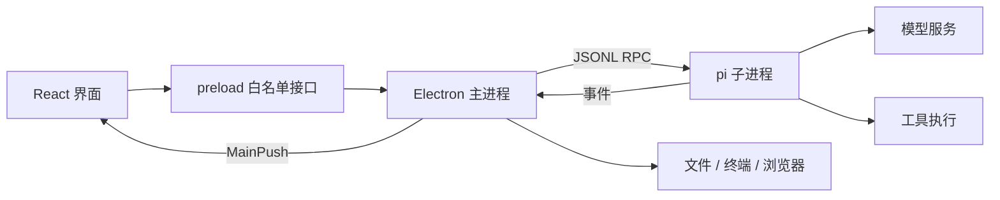

# Inkstone 架构简介

Inkstone 使用 Electron、React 和 TypeScript，通过独立 pi 子进程完成模型循环与工具执行。

```mermaid
flowchart LR
  UI[React 界面] --> Bridge[preload 白名单接口]
  Bridge --> Host[Electron 主进程]
  Host -->|JSONL RPC| Pi[pi 子进程]
  Pi --> Provider[模型服务]
  Pi --> Tools[工具执行]
  Host --> Workspace[文件 / 终端 / 浏览器]
  Pi -->|事件| Host
  Host -->|MainPush| UI
```

## 职责

- **渲染进程**：会话与项目界面、输入、内容展示和用户操作；通过 preload 使用宿主能力。
- **preload 与共享契约**：限制可调用入口，维护跨进程类型和事件结构。
- **主进程**：会话生命周期、pi RPC、文件和终端、浏览器表面及配置持久化。
- **pi**：模型循环、上下文与工具执行；随包适配位于 `resources/`。

上下文管理归 Agent：pi 的原生压缩、恢复、技能与项目规则由 pi 执行，其他 CLI Agent 使用自己的机制。砚展示用量、压缩状态和工具结果，用户点选的压缩操作直接走 pi RPC；不生成宿主摘要，不按工作集预算改写请求，不自动交接或续跑。资料由用户主动发送，或由 Agent 自己读取。

pi 0.99 及以上的 MCP、codemode 与工具搜索使用原生内置扩展。宿主的共享浏览器、电脑操作与授权协调继续经过砚的能力入口；旧宿主 MCP 配置保留兼容，新配置优先使用 pi 的 `mcp.json`，不把受管设备服务自动迁移到另一套权限边界。

## 数据与运行边界

本地设置和会话由应用与 pi 持久化；连接远程模型时，请求发送至所选服务。数据位置见 [发布与备份](dev/RELEASING.md#数据位置与备份)。应用的本地档案不等于模型账号登录。

Electron 网页表面与 React DOM 分属不同层，浏览器浮层、窗口缩放和焦点切换需要在宿主与界面间协调。切换会话时应明确各事件所属的会话，避免后台事件覆盖当前会话状态。

具体文件入口见 [代码导览](PROJECT.md) 和 [按功能查找的代码地图](CODE_MAP.md)。语言、桌面壳与手机客户端的取舍见 [技术路线评估](TECH_STACK_OPTIONS.md)。接口以源码为准，本页不记录内部排期或阶段验收结论。
