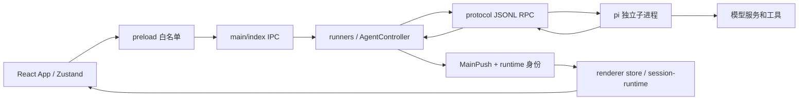

# Inkstone 代码地图

[文档索引](README.md) · [代码导览](PROJECT.md) · [架构简介](ARCHITECTURE.md) · [技术路线](TECH_STACK_OPTIONS.md)

面向维护者与接手任务的 Agent。本页按**要改什么**定位源码；目录所有权与更多功能文件见 [PROJECT.md](PROJECT.md)。以当前源码为准，修改前先看 `git status --short` 和目标文件；不要把生成物、发行目录或本机内部资料当作源码。以下是 2026-10-01 按当前工作区源码更新的静态导航，不代表各功能已完成运行验证。

接手任务时按这条顺序查：**用户操作 → preload/IPC 或远程入口 → 宿主服务与 pi RPC → 持久记录 → 运行事件与渲染投影**。先确认当前请求需要哪个平台、在哪台设备执行；跨端方案同时看 [技术路线](TECH_STACK_OPTIONS.md)，按个人开发者可维护的首版范围收敛。未在地图中列出的文件用 `rg --files` / `rg` 定位，不能因地图没有列出就断言能力不存在。

## 一条消息经过哪里

| 环节 | 先读文件 | 改动时留意 |
| --- | --- | --- |
| 桌面启动与装配 | `src/main/index.ts`、`src/main/paths.ts`、`src/main/settings.ts` | `index.ts` 负责装配与生命周期：建存储与服务、启动 pi、创建窗口，并在启动前把宿主能力接到各服务（`configureGoalCoordinator` / `configureHandoffCoordinator` / `configureRemoteHost`）；发送 / 中止等运行控制与窗口类 IPC 仍在入口，不要把业务判断再复制到新入口。设置在 `patchSettings` 写盘失败时**如实抛错、不更新缓存**（旧行为是只打日志并返回新设置，界面会显示“已保存”而重启后变回旧值） |
| pi 进程与协议 | `src/main/protocol.ts`、`src/main/agent.ts` | pi 通过独立 JSONL RPC 子进程运行；`protocol.ts` 使用 Electron 自带 Node 和 `--mode rpc` |
| 并发会话 | `src/main/runners.ts`、`src/main/agent.ts`、`src/main/index.ts` | `runnerId/runId`、`sessionId`、`generation` 含义不同；切换视图不能停掉仍在跑的会话 |
| 宿主接口 | `src/shared/ipc.ts` → `src/preload/index.ts` → `src/main/ipc/<领域>-ipc.ts`（经 `ipc/registrar.ts` 注册） | 按领域的注册器：会话、目标 / 模式 / 交接、空间与档案、资料、来源、文件、Git、插件包、能力、长期记忆、任务收件箱、持续关注、旧上下文接口兼容、子代理、砚对砚、同意记录、模型接入等；依赖经参数显式传入。新增能力核对类型、白名单与处理器；注册器统一校验调用者是主窗口。持续关注的只读入口（`list` / `views` / `due` / `runs`）必须在宿主侧先 `await load()`，否则重启后还没有任何写操作时读到的是空文档 |
| 推送到界面 | `src/main/index.ts` 的 `pushFrom`、`src/shared/ipc.ts` 的 `MainPush`、`src/renderer/src/state/store.ts` 的 `applyPush` | 身份与归属判定在 `state/push-routing.ts`（纯函数，`scripts/test-push-routing.mjs`）：旧代次丢弃、后台会话只进 `state/session-runtime.ts` 缓存；窗口 / 提问与通知 / 子代理 / 任务状态由 `state/push-consumers.ts` 分别消费，会话与消息的核心投影在 store |
| 用户看到的对话 | `src/renderer/src/App.tsx`、`components/chat/TurnView.tsx`、`MessageParts.tsx`、`Composer.tsx` | 消息是历史与运行事件的投影；草稿、队列和流式状态另有归属 |

## 按问题找代码

| 任务或症状 | 主要入口 | 相邻契约与状态 |
| --- | --- | --- |
| 会话创建、切换、历史或标题 | `src/main/runners.ts`、`sessions.ts`、`session-reader.ts`、`session-history.ts`、`title.ts` | `src/main/agent.ts`、`src/renderer/src/state/store.ts`、`src/shared/ipc.ts`；持久会话记录以 pi JSONL 为准。快速连点切会话时由 `store.ts` 的**选择代次**决定归属：过期的 peek 既不写投影、也不再请求主进程激活（否则先点的慢会话会把后点的覆盖掉） |
| 后台 Agent、队列、停止与继续 | `src/main/session-work-scheduler.ts`（回合收尾观察）、`goal-coordinator.ts`（工作模式、活动档案和目标状态）、`src/main/runners.ts`、`goal-service.ts` | `src/main/agent.ts` 的事件、发送和原生队列；`src/shared/goal.ts`、`src/renderer/src/state/session-runtime.ts`。宿主自动错误重试、目标续跑与自动交接均停用 |
| 子 Agent、隔离工作区与交接 | `components/workbench/AgentWorkspacePanel.tsx`（统一入口与运行标签）、`src/shared/agent-workspace.ts`（只读投影）、`src/main/subagent-service.ts`（`yan subagent` 共用的控制器）、`subagents.ts`、`subagent-isolation.ts`、`session-isolation.ts`、`handoff-coordinator.ts`（历史交接兼容，自动判资格入口停用）、`handoff-service.ts`、`handoff-transaction-service.ts` | `src/shared/subagent-brief.ts`、`handoff.ts`、`handoff-transaction.ts`；`scripts/test-handoff-host-regression.mjs` 从 `handoff-coordinator.ts` 取函数驱动 |
| Agent 原生上下文与历史召回 | `src/shared/agent-context.ts`、`src/main/agent.ts`、`src/main/compaction.ts` | 原生 pi RPC 执行压缩与恢复；`NativeContextSection.tsx` / `NativeContextTab.tsx` 只显示用量与直接操作。旧宿主上下文改写、预算观察/整理、项目知识自动注入、目标续行与交接扩展源码已移除；旧预算 IPC 拒绝修改，历史资料保留，`context-recall.ts` 提供主动归档回读。`pi-runtime-location.ts` 选择 runtime generation；`scripts/vendor-pi.mjs` 保留官方 Codemode 的 QuickJS WASM / worker，`scripts/lib/pi-upgrade-policy.mjs` 阻止隐式降级；`scripts/test-agent-native-context.mjs` 检查退役边界 |
| 扩展命令、模型能力与工具接入 | `resources/pi-extensions/`、`src/main/capabilities/`（`acquisition-commands.ts`：`yan capabilities` 检索 / 发现 / 计划 / 接入）、`src/main/mcp/` | `src/main/agent.ts` 的 `runCapabilityCommand` 分派，其余宿主工具在 `browser-commands.ts`、`lookup-commands.ts`（`yan search` / `yan knowledge`）；`src/main/extensions-inventory.ts`、`resources/yan-cli/yan.mjs`；宿主能力优先放宿主，pi 扩展保持薄 |
| 本机远程管理入口 | `src/main/remote-server.ts`、`src/main/remote-host.ts`（会话摘要、历史、有限会话操作与砚对砚开放数据；与桌面会话 IPC 共用 `session-host.ts`）、`src/main/remote-devices.ts`（配对码与设备表）、`src/main/index.ts` 的 `startRemoteServer` | 显式命令白名单与事件筛选；手机设备配对即可访问；配对校验-消费-设备表落盘在同一串行队列（并发下也只能用一次），设备表写盘失败可恢复、撤销以落盘成功为准 |
| 砚对砚互通 | 所有者侧：`src/main/peer-grants.ts`（本次连接授权）、`remote-server.ts` 的 `handlePeer`、`remote-host.ts` 的 `peerHostHandlers`、`ipc/peer-host-ipc.ts`、`components/shell/PeerApprovalDialog.tsx`；连接者侧：`src/main/peer-client.ts`、`ipc/peer-ipc.ts`、`components/settings/PeerTab.tsx` | `src/shared/peer-protocol.ts`；peer 令牌只进 `/remote/v1/peer/*`，授权绑定事件流、断开即失效；`scripts/test-peer.mjs` 钉住门禁 |
| 项目、工作树、Git 状态 | `src/main/session-layout.ts`、`project-id.ts`、`git-service.ts`、`git-worktree.ts`、`git-actions.ts` | `src/renderer/src/components/rail/`（`Rail.tsx` 主体、`useRailDrag` 拖拽、`useRailProjects` 项目数据、`RailViewMenu` 视图菜单）、`components/review/`、`src/shared/git.ts` |
| 内置浏览器与 Chrome | `src/main/browser.ts`、`src/main/browser/`、`src/main/chrome.ts` | `components/browser/BrowserSurface.tsx`；网页是原生 `WebContentsView`，位置、缩放与焦点由主进程协调 |
| 多 Agent 工作台 | `src/shared/agent-hub.ts`、`src/main/agent-hub/service.ts`、`resources/yan-cli/hub-mcp.mjs` | 桌面 `AgentWorkspacePanel.tsx` 汇总子 pi 与 Hub 运行，`components/workbench/AgentHubPanel.tsx` 展示 Hub 详情 → preload / `ipc/agent-hub-ipc.ts` → 任务服务 → Codex app-server / Claude stream-json / pi RPC / PTY；`workspaces.ts` 冻结与重建成果，`resources.ts` 协调浏览器与 Windows 输入；手机 `mobile/src/screens/AgentHubScreen.tsx` 经 `remote-server.ts` 接同一服务 |
| 终端、文件与附件 | `src/main/terminal.ts`、`files.ts`、`attachments.ts`、`file-refs.ts` | `components/chat/Terminal.tsx`、`components/terminal/TerminalSurface.tsx`、`components/toolbar/FilePreview.tsx`；终端依赖 `node-pty` |
| 随包技能（领域做法按需加载） | `resources/skills/<名称>/SKILL.md`（现有 office、research、subagent、playbook、tutor、capabilities、doc-sync、writing、organize、follow、memory）；用户技能在 `YAN_DIR/skills`（`src/main/user-skills.ts`）（打包到 resources/yan-skills）、`src/main/index.ts` 的 `bundledSkillPaths` | `AgentController` 以 `--skill` 显式传入随包和用户技能，同时允许 pi 原生技能发现；领域流程优先写成技能，宿主只保留技能做不到的部分（真实文件预览、授权、持久数据） |
| 办公文件预览（docx / xlsx / pptx / pdf） | `src/main/office/`（`zip.ts`、`extract.ts`、`office-service.ts`）、`src/main/ipc/office-ipc.ts` | `src/shared/office.ts`（预览类型）、`components/review/OfficeContent.tsx`（文件文字预览）、`yan office read`（`src/main/agent.ts` 的 `office.read`）；只提取文字，不还原版式 |
| 应用更新与对话内文件链接 | `src/main/app-update.ts`（GitHub Release 检查；安装版经 electron-updater 下载，便携版 / 开发版只给手动入口；有任务运行时拒绝重启安装）、`index.ts` 的 `yan:openFileDefault`（可运行类型与网络路径只在文件管理器定位，不启动）、`search/opencli.ts` 的 `installOpenCli`（设置页显式点击才执行 npm 全局安装） | `components/settings/AppUpdateSection.tsx`、`src/shared/app-update.ts`；更新未做真实安装升级验证 |
| 电脑本地语音输入（whisper.cpp） | `src/main/voice/voice-service.ts`、`src/main/ipc/voice-ipc.ts` | `src/shared/voice-input.ts`（模型目录、按配置推荐、WAV 编码、输出解析）、`components/chat/VoiceInputButton.tsx`（录音 → 转写 → 插入输入框）、`components/settings/VoiceTab.tsx`；下载先 `plan` 核实大小与位置，用户确认后才 `download`；录音只存临时文件 |
| 检查点与回退代码 | `src/main/checkpoints.ts`（影子 git 仓库：发送前快照、预览、恢复、撤销、30 天清理）、`ipc/checkpoint-ipc.ts`；`index.ts` 的 `yan:send` 在新一轮前调用 | `src/shared/checkpoints.ts`（类型与消息匹配）、`components/shell/RewindDialog.tsx`、`TurnView.tsx` 的「回退代码」；`scripts/test-checkpoints.mjs` 用真 git 在临时目录验证 |
| 会话切换器与正文检索 | `src/main/session-search.ts`（会话 JSONL 的内存索引与检索）、`ipc/session-ipc.ts` 的 `yan:searchSessions` | `src/shared/session-search-text.ts`（取文字、拆词、片段）、`components/shell/SessionSwitcher.tsx`（Ctrl+K，`App.tsx` 接键） |
| 写入项目之外前确认 | `resources/pi-extensions/danger-guard.js` 的 `outsideWrites`（读 `desktop.json` 的 `guardOutsideWrites` / `guardAllowRoots`）、`index.ts` 的 `confirmDanger`（可「允许并记住目录」） | 设置在 `components/settings/CapabilitiesTab.tsx`；`scripts/test-danger-guard.mjs` |
| 普通工具的自动调用依据 | `src/shared/tool-consent.ts`（键、危险类别、衰减与 Wilson 下界判定）、`src/main/consent-store.ts` | `src/main/agent.ts` 的 `consent.request`（`yan consent request`）、`index.ts` 的确认框、`ipc/consent-ipc.ts`、`components/settings/ConsentSection.tsx`；只记录确认框里的真实答复，危险类别与远程场景永远询问；另有**高危操作确认**：`resources/pi-extensions/danger-guard.js`（`tool_call` 钩子，命中大范围删除 / 强推 / 丢弃改动等才向宿主发 `danger.confirm`，宿主每次弹框、不记忆；是提醒式护栏不是沙箱，命中却无法确认时拦下）+ `agent.ts` 的 `runDangerConfirmCommand`、`index.ts` 的 `confirmDanger`，判定用例 `scripts/test-danger-guard.mjs` |
| 模型登录、凭证、设置 | `src/main/oauth.ts`（ChatGPT）、`oauth-providers.ts`（Claude / Copilot / xAI / OpenRouter，驱动随包 pi 的登录模块）、`credentials.ts`、`custom-providers.ts`、`settings.ts` | `components/settings/AuthTab.tsx`（登录面板）、`src/shared/model-capabilities.ts`；本地档案不代表模型账号已登录。**auth.json 的所有写入（合并一条、退出登录、切换账号）统一走 `credentials.ts` 的持锁读改写**，与 pi 同一把 `auth.json.lock` 并会刷新 mtime |
| 模型能否思考、单模型协议 | `src/shared/custom-provider.ts` 的 `describeDiscoveredModels`（端点给的 `supported_endpoints` / `context_length` + 按模型 ID 查 pi 自带目录）、`resources/pi-extensions/generated/pi-model-catalog.json`（`scripts/gen-pi-model-catalog.mjs` 生成） | 自定义服务的「获取模型列表」走 `custom-providers.ts`；pi 不认识的 Command Code 由 `resources/pi-extensions/commandcode.js` 注册（凭证页填了密钥、且 models.json 没手写时），它用的是同一套逻辑的生成物 `generated/model-capabilities.mjs`（`scripts/build-model-capabilities.mjs`）；只有「关」一档时 `Pickers.tsx` 说明原因 |
| 电脑操作（Computer use） | `src/main/computer-use.ts`（检测 / 安装 uv，开关时改宿主 `mcp-servers.json` 中的 `windows-mcp` 条目，只开放界面操作工具）、`ipc/capabilities-ipc.ts` 的 `yan:computerUse:*`、`runners.ts` 的 `reloadMcpServers` | `components/settings/ComputerUseSection.tsx`（能力与插件页）；Python 与 windows-mcp 由用户的 uv 下载，不随包 |
| 品牌资产与启动画面 | `scripts/build-icon.mjs`（ICO / PNG / 托盘深浅字形）、`scripts/build-installer-sidebar.mjs`、`mobile/scripts/build-launcher-icons.mjs` 与 `sync-brand.mjs`；托盘按系统任务栏深浅切换在 `src/main/index.ts` 的 `trayImage` | 启动画面：`src/renderer/index.html` 的 `#boot` + `public/boot-theme.js`、`lib/boot-splash.ts`（App 在设置、会话、pi 连接有结论后撤）；手机 `motion.tsx` 的 `BootSplash` 与 `res/values-v31/styles.xml` |
| 主题空间与资料 | `src/main/space-store.ts`、`library-*`；旧学习记录导出在 `learning-export.ts` | 对应 `src/shared/space.ts`、`library.ts` 与 `components/workbench/`；PDF 内容流解压有单流 / 累计输出预算，超限的流跳过并在 note 说明；三个 Store（空间 / 资料库 / 活动档案）落盘失败时会把内存恢复到磁盘上的真实内容，不会把失败的操作留到下一次保存；学习做法在 `resources/skills/tutor` |
| 成果、文件引用与预览 | `src/main/artifacts.ts`（按会话的成果 manifest）、`src/renderer/src/state/source-files.ts`（文件来源登记）、`src/shared/file-url.ts`（本地路径 → `file://`） | 成果 manifest 的「读 → 加 → 写」按会话串行化并原子替换，并发保存不会互相覆盖；文件来源登记必须按会话读写（在 B 会话加文件不能清掉 A 会话的记录，读侧也要按会话过滤）；本地路径逐段转义（`#` / `?` / `%` 是 URL 语法字符，不能整串 `encodeURI`） |
| 项目知识、个人记忆与长期记录 | `src/main/project-memory-store.ts`、`personal-memory.ts`（个人范围、外部工具收件箱与导出）、`ipc/knowledge-ipc.ts` | `src/shared/project-memory.ts`；按来源、归属与版本处理，避免与会话原文混同 |
| 联网搜索与能力获取 | `src/main/search/`、`src/shared/search.ts`、`src/main/capabilities/` | `scripts/probe/search.mjs` 与 `search-electron.mjs` 区分普通 Node 与 Electron 环境；读网页正文的隐藏页面与内置浏览器同一套网络边界（字面内网与解析到内网都拦），判定在 `browser/network-boundary.ts`；隐藏页面的超时会取消轮询（`withHiddenPage` 交出 AbortSignal），不只销毁窗口 |
| 底部状态栏与右栏检查器 | `components/shell/StatusBar.tsx`（模式、分支、pi、手机、本轮用量与花费）；`components/toolbar/RightPanel.tsx`（分区注册、布局与浮出磁贴）及各分区文件 `NativeContextSection.tsx`、`QuotaSection.tsx`、`TodoSection.tsx`、`PanelSections.tsx` | 状态都从 store 快照推导，不自己计时；用量口径在 `components/chat/UsageBar.tsx`，窄窗隐藏顺序见[设计规范](DESIGN_SYSTEM.md) §4 |
| 手机端界面（Android） | `mobile/src/App.tsx`（路由与折叠屏双栏）、`mobile/src/screens/`、统一控件 `mobile/src/ui.tsx`、令牌 `theme.ts`、动效 `motion.tsx` | 色值与 `tokens.css` 同源（`npm run check:mobile-tokens`）；接口是 `src/shared/remote-protocol.ts`，桌面侧在 `src/main/remote-host.ts`；规则见[设计规范](DESIGN_SYSTEM.md) §7 |
| 样式、图标、动效与多语言 | `src/renderer/src/styles/`（控件外观在 `ui.css`）、`components/ui/`、`icons/`、`i18n/` | [设计规范](DESIGN_SYSTEM.md)、`scripts/design/icons/` 和生成清单；改界面时同时检查深浅主题、键盘与窄窗口 |

## 数据与构建边界

- `src/main/paths.ts` 定义 `PI_AGENT_DIR`、`YAN_DIR`、Electron 用户目录及便携版路径。数据目录迁移在 `src/main/storage-move.ts`（`storage-move-boot.ts` 是 main 的第一个 import，下次启动时搬到新位置并在原处留目录联接；入口在设置 → 关于 → 数据位置）。会话文件里的任务 / 自定义条目由 `session-entries-lite.ts` 增量读取，不经 pi 的 `get_entries` 搬运整份会话。真实用户会话、凭证和发行版 `release/砚数据/` 只读；验证用独立 `YAN_*` 目录。
- pi 会话本体为 JSONL；砚的设置、任务与投影由各自 store 保存在 `YAN_DIR`。不要把界面缓存当作历史事实源。
- `resources/pi-runtime/`、`out/`、`release/` 是生成物或分发内容。旧预算扩展生成流程已移除；`src/shared/context-budget-v1.ts` 仍供旧接口类型、设置解析与模型端点标识使用，不表示启用宿主预算。
- 常用检查见 [贡献指南](CONTRIBUTING.md)。`test:unit` 依赖构建；`test:live` 不自动构建。运行、构建、实际界面和发行包分别说明证据。

## 下一轮代码整理从哪里下手

主进程的任务调度（目标续跑、自动交接、会话调度）、按领域的 IPC 注册器、远程宿主，`AgentController` 的宿主工具、界面请求与回合计时，以及渲染端的推送归属判定已经拆出。`AgentController.handleEvent`（pi 事件 → 界面状态）仍集中在 `agent.ts`，与 pi RPC 执行核心一起保留；再拆时沿已有边界小步迁移，`runners.ts`、`session-runtime.ts` 等先复用。行数本身不证明性能问题。语言或应用壳的取舍见 [技术路线](TECH_STACK_OPTIONS.md)。
